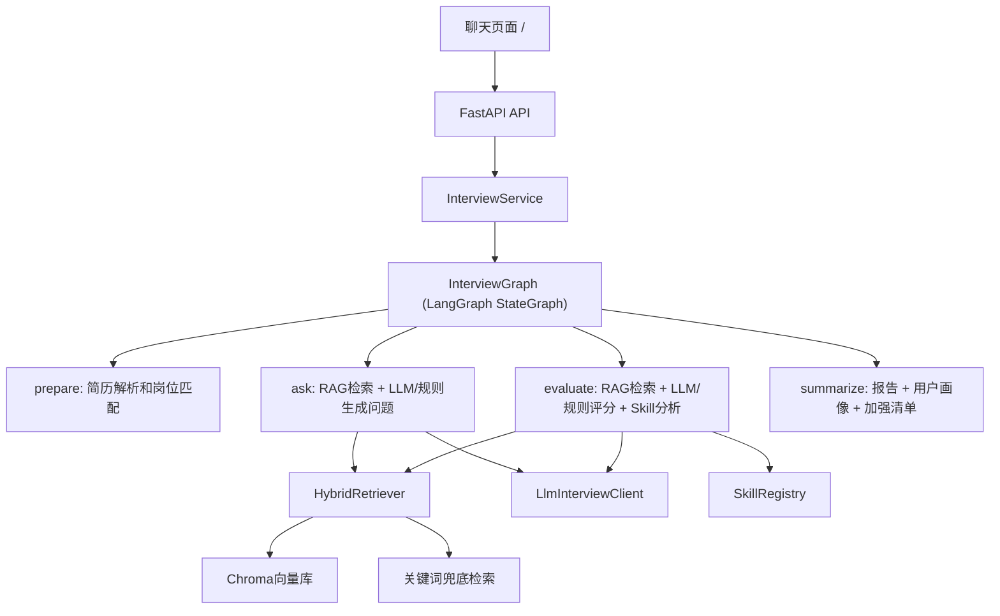

# IntervAI 模块工程文档

本文档说明 `intervai` 面试模块的设计、核心代码、数据流、API、扩展方式和测试方式。它面向后续开发、项目演示和面试讲解。

## 1. 模块目标

IntervAI 的面试模块不是简单问答机器人，而是一个有状态、可评估、可追问、可沉淀用户画像的模拟面试系统。

核心能力：

- 根据简历和目标岗位选择面试方向。
- 基于 RAG 知识库生成问题、参考依据和标准回答。
- 通过 LangGraph 控制面试状态流转。
- 对用户回答做结构化评分、追问决策和弱项收集。
- 在结束后生成报告、用户画像和加强清单。
- 没有 API Key 时仍可离线演示，走规则和关键词 RAG 兜底。

## 2. 目录结构

```text
intervai/
  api.py        FastAPI接口和聊天页面
  graph.py      LangGraph状态图封装
  llm.py        可选LLM提问、标准答案和评估层
  rag.py        Chroma优先、关键词兜底的混合检索器
  resume.py     简历文本解析和技能提取
  schemas.py    面试会话、轮次、阶段等数据结构
  service.py    面试业务编排核心
  skills.py     可插拔面试技能分析器

data/interview_knowledge/
  rag_engineering.md
  langgraph_workflow.md
  fastapi_production.md
  backend_system_design.md
  algorithm_behavior.md

tests/test_intervai_service.py
  面试流程、RAG、LLM兜底、API和报告测试
```

## 3. 总体架构



系统分成三层：

- **接口层**：`api.py` 暴露 REST API 和内置聊天页面。
- **编排层**：`service.py` 调用 LangGraph、RAG、LLM、Skill。
- **能力层**：`rag.py`、`llm.py`、`skills.py`、`resume.py` 提供独立能力。

## 4. 面试状态机

状态定义在 `schemas.py` 的 `InterviewStage`：

```text
PREPARE   准备阶段，解析简历并确定能力模型
ASK       生成下一题
ANSWER    等待用户回答
EVALUATE  评估用户回答
FOLLOW_UP 标记需要追问
SUMMARY   生成最终报告
```

实际 LangGraph 封装在 `graph.py` 的 `InterviewGraph`。

图结构：

```text
START
  -> prepare
  -> ask
  -> END

START
  -> evaluate
  -> ask 或 summarize
  -> END
```

为什么 `ask` 后直接 `END`：

- HTTP API 是请求响应式，不是一次运行完整面试。
- 创建面试时运行到首题生成即可返回。
- 用户提交回答后，再从 `evaluate` 继续运行。
- 如果还没结束，图会进入下一轮 `ask`；如果结束，进入 `summarize`。

## 5. 核心数据结构

### InterviewSession

`InterviewSession` 表示一次完整面试会话。

关键字段：

```text
session_id          会话ID
job_title           目标岗位
resume_text         简历文本
job_description     岗位描述
stage               当前状态
candidate_profile   简历解析结果
competency_model    能力模型
turns               面试轮次列表
asked_count         已提问数量
max_questions       最大题目数
current_question    当前问题
finished            是否结束
report              最终报告
user_profile        用户画像
```

### InterviewTurn

`InterviewTurn` 表示一题一答。

关键字段：

```text
question          面试问题
answer            用户回答
standard_answer   标准回答要点
evaluation        评分结果
references        RAG参考依据
skill_result      Skill分析结果
```

设计重点：

- `references` 保存问题和评估使用过的知识依据。
- `standard_answer` 给用户一个“优秀回答应该覆盖什么”的参照。
- `evaluation` 存结构化评分，不只存一句反馈。
- `skill_result` 给未来 MCP/工具执行留扩展位。

## 6. API 说明

### GET `/`

返回内置聊天页面。

能力：

- 输入岗位、题目数量、简历文本、岗位描述。
- 展示面试问题、用户回答、每题评分、参考依据、标准回答。
- 面试结束后展示 JSON 报告。

### GET `/health`

健康检查。

返回：

```json
{
  "status": "ok",
  "service": "IntervAI"
}
```

### POST `/knowledge/initialize`

显式初始化 Chroma 向量库。

返回：

```json
{
  "vector_store_initialized": true
}
```

注意：

- 需要环境变量 `DASHSCOPE_API_KEY`。
- 如果没有 API Key，会返回 `false`，系统仍可使用关键词检索兜底。

### POST `/interviews`

创建面试。

请求：

```json
{
  "resume_text": "我熟悉 Python、FastAPI、RAG 和 LangGraph。",
  "job_title": "AI应用工程师",
  "job_description": "负责RAG和Agent应用落地。",
  "max_questions": 3
}
```

响应重点字段：

```json
{
  "session_id": "itv_xxx",
  "stage": "answer",
  "current_question": "...",
  "turns": [
    {
      "question": "...",
      "standard_answer": "...",
      "references": ["..."]
    }
  ]
}
```

### POST `/interviews/{session_id}/answers`

提交回答。

请求：

```json
{
  "answer": "我会做文档切分、向量检索、重排序、引用溯源和离线评测。"
}
```

如果未结束，响应会包含下一题。如果结束，响应会包含 `report`。

## 7. 核心流程

### 7.1 创建面试

入口：`InterviewService.create_session`

流程：

1. 创建 `InterviewSession`。
2. 调用 LangGraph，从 `PREPARE` 开始。
3. `_prepare` 解析简历，生成 `candidate_profile`。
4. 根据简历和岗位判断 track：
   - `ai`
   - `backend`
   - `general`
5. 生成 `competency_model`。
6. 进入 `_ask` 生成第一题。
7. 保存 session 并返回。

### 7.2 生成问题

入口：`InterviewService._ask`

流程：

1. 生成兜底问题 `_fallback_question`。
2. 读取上一轮缺失点 `_last_gap`。
3. 使用岗位、JD、兜底问题、缺失点调用 RAG 检索。
4. 将检索结果格式化为 `references`。
5. 调用 `LlmInterviewClient.generate_question`：
   - 有 LLM：基于 RAG 生成问题。
   - 无 LLM：返回兜底问题。
6. 调用 `generate_standard_answer` 生成标准回答。
7. 创建 `InterviewTurn`。

题目来源策略：

- 当前题目不是纯写死题库。
- 题库只是 fallback。
- 真正生成时会融合：
  - 简历摘要
  - 目标岗位
  - 岗位描述
  - 能力模型
  - 历史问答
  - 上一轮缺失点
  - RAG参考资料

### 7.3 标准回答

标准回答字段：`InterviewTurn.standard_answer`

生成方式：

- 有 LLM：`LlmInterviewClient.generate_standard_answer`
- 无 LLM：`_standard_answer`

标准回答会覆盖：

- 目标和约束澄清
- 核心知识点
- 落地方案
- 工程权衡
- 验证方式
- RAG参考依据

用途：

- 面试后给用户对照。
- 报告中保留每题标准答案。
- 后续可以做“用户回答 vs 标准答案”的精细差距分析。

### 7.4 评估回答

入口：`InterviewService._evaluate_latest_answer`

流程：

1. 使用问题、回答、岗位信息再次 RAG 检索。
2. 从知识依据中抽取 expected terms。
3. 规则评分生成 `rule_evaluation`。
4. 调用 SkillRegistry 做专项分析。
5. 调用 LLM 做结构化评分：
   - 有 LLM 且输出 JSON 有效：使用 `llm_rag`
   - 否则使用 `rules_fallback`
6. 根据 `needs_follow_up` 决定下一步：
   - 继续追问/下一题
   - 或进入总结

评估结果结构：

```json
{
  "score": 88,
  "matched_points": ["检索", "评测"],
  "missing_points": ["权限隔离"],
  "main_gap": "权限隔离",
  "needs_follow_up": false,
  "evidence": ["RAG工程评估 | ..."],
  "improvement_advice": ["补充多租户权限隔离策略。"],
  "comment": "回答覆盖了主要链路，但权限隔离还可以加强。",
  "source": "llm_rag"
}
```

### 7.5 生成报告和用户画像

入口：`InterviewService._summarize`

报告字段：

```text
overall_score        总分
llm_enabled          是否启用LLM
graph                图结构说明
user_profile         用户画像
improvement_backlog  待加强清单
dimensions           多维能力分
weak_points          聚合弱项
evidence_sources     引用依据
recommendations      学习建议
next_practice        下一轮练习题
turn_reviews         逐题复盘
```

用户画像由 `_build_user_profile` 生成。

画像包含：

```text
level                 ready / promising / needs_practice
summary               总体诊断
target_role           目标岗位
detected_skills       简历中识别出的技能
strengths             回答覆盖过的优势点
weaknesses            高频缺失点和建议
answer_style          回答长度、表达风格、Skill信号
improvement_backlog   按优先级排序的加强任务
```

## 8. RAG 设计

核心类：`HybridRetriever`

检索优先级：

1. 如果存在 Chroma 向量库，优先向量检索。
2. 如果 Chroma 不可用、没有 API Key、向量库未初始化或检索失败，走关键词检索。

### 知识库位置

```text
data/interview_knowledge/
```

当前主题：

- RAG工程评估
- LangGraph工作流
- FastAPI生产化
- 后端系统设计
- 算法与行为面评分

### KnowledgeHit

检索结果统一为：

```text
title     标题
content   内容片段
source    来源
score     分数
```

`as_reference()` 会格式化成适合放进 Prompt 和报告的字符串。

### 初始化向量库

接口：

```text
POST /knowledge/initialize
```

内部调用：

```python
HybridRetriever.initialize_vector_store()
```

要求：

- 已安装 Chroma 相关依赖。
- 已配置 `DASHSCOPE_API_KEY`。
- 使用 `text-embedding-v4` 生成向量。

## 9. LLM 设计

核心类：`LlmInterviewClient`

启用条件：

- `enabled=True`
- 环境变量存在 `DASHSCOPE_API_KEY`
- 能成功导入项目已有 `model.factory.chat_model`

否则自动降级。

### generate_question

用于生成下一道问题。

输入：

- 目标岗位
- 岗位描述
- 简历摘要
- 能力模型
- RAG参考
- 历史问答
- 上一轮缺失点
- 兜底问题

输出：

- 一个问题字符串。

### generate_standard_answer

用于生成标准回答。

输入：

- 目标岗位
- 问题
- RAG参考
- 兜底标准答案

输出：

- 标准回答要点。

### evaluate_answer

用于结构化评分。

要求 LLM 只输出 JSON。

失败处理：

- JSON解析失败时返回 `None`。
- 服务层自动回退到规则评分。

## 10. Skill 设计

核心类：`SkillRegistry`

当前内置 Skill：

```text
CodeExecutionSkill     算法/代码回答的AST静态检查
SystemDesignSkill      系统设计维度覆盖分析
BehavioralSkill        行为面STAR覆盖分析
```

Skill 输出会放在：

```text
InterviewTurn.skill_result
```

未来扩展：

- 代码沙箱执行 MCP Tool
- 架构图生成 MCP Tool
- GitHub 项目分析 Tool
- SQL/数据库设计检查 Tool

## 11. 离线兜底策略

系统必须在没有 API Key 时仍可运行。

兜底点：

- LLM不可用：使用固定题库和规则标准答案。
- Chroma不可用：使用关键词检索。
- LLM评分失败：使用规则评分。
- Skill不匹配：`skill_result=None`，不影响主流程。

这保证了项目演示时不会因为外部服务不可用而完全失败。

## 12. 测试覆盖

测试文件：`tests/test_intervai_service.py`

覆盖内容：

- FastAPI 创建面试和提交回答。
- 无 API Key 时仍可完成面试和报告。
- AI岗位能命中 RAG/LangGraph 相关问题。
- 关键词 RAG 能命中 RAG、FastAPI、短链接、STAR。
- 向量不可用时回退关键词检索。
- Fake LLM 的 JSON 评估能写入报告。
- 标准答案、用户画像、加强清单能被序列化返回。

运行：

```bash
python -m pytest tests\test_intervai_service.py
```

## 13. 典型演示话术

可以这样向面试官介绍：

> 这个模块用 LangGraph 管理面试状态，不是简单链式 Prompt。每一题都会先基于岗位、简历、上一轮缺失点和 RAG 知识库检索评分依据，再生成问题和标准答案。用户回答后，系统会结合 RAG 证据、规则评分和 Skill 分析输出结构化评价。如果候选人缺少关键点，下一轮会围绕缺失点追问。最后系统会沉淀用户画像、弱项清单和下一轮练习建议。

技术亮点：

- LangGraph 控制状态流转。
- RAG 提供问题和评分依据。
- LLM 只在可用时增强，不可用时有规则兜底。
- Skill 层为未来 MCP 工具调用留扩展口。
- 报告不是简单总结，而是包含画像和改进 backlog。

## 14. 后续优化建议

优先级从高到低：

1. **修复终端/文件显示中的中文编码问题**
   - 确保所有源码、Prompt、测试、文档均为 UTF-8。
   - 避免中文在 PowerShell 或编辑器中显示为乱码。

2. **持久化会话**
   - 当前 session 存在内存里。
   - 可用 SQLite 或 Redis 保存面试记录、报告和用户画像。

3. **标准答案差距分析**
   - 当前标准答案已生成。
   - 下一步可对比用户回答和标准答案，输出“遗漏句级证据”。

4. **RAG评测集**
   - 为知识库增加查询集。
   - 评估召回是否命中正确主题。

5. **MCP工具执行**
   - 代码题进入真实沙箱执行。
   - 系统设计题生成架构图。
   - 报告导出 PDF 或发送邮件。

6. **前端报告视图**
   - 当前报告以 JSON 展示。
   - 可改为分区卡片：总分、能力雷达、逐题复盘、弱项 backlog、学习路径。
